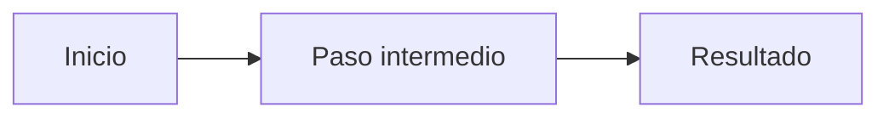

# Proyecto Salto — Marketplace de casos de uso

Sitio estático que muestra los casos de uso de IA desarrollados por champions de Grupo UNACEM. El contenido vive en archivos Markdown; al hacer push, Vercel redespliega el sitio.

Documentación técnica adicional: [docs/index.md](docs/index.md).

## Requisitos

- Node.js 20 o superior
- npm

## Cómo correr en local

1. Abre una terminal en la raíz del proyecto.
2. Instala dependencias:

```powershell
npm install
```

3. Arranca el servidor de desarrollo:

```powershell
npm run dev
```

4. Abre [http://localhost:3000](http://localhost:3000) en el navegador.

Para generar el sitio estático (igual que en Vercel):

```powershell
npm run build
npm start
```

## Cómo agregar un caso nuevo

No hace falta tocar código de React ni de Next.js. Solo creas un archivo Markdown y haces push.

### Paso 1 — Crear el archivo

En la carpeta `content/casos/`, crea un archivo `.md`. El **nombre del archivo** será la URL.

| Archivo | URL |
|---|---|
| `content/casos/mi-nuevo-caso.md` | `/casos/mi-nuevo-caso` |

Usa solo minúsculas, números y guiones (sin espacios ni acentos en el nombre del archivo).

### Paso 2 — Completar el encabezado (front-matter)

Al inicio del archivo, entre `---`, van estos campos:

```yaml
---
titulo: "Título corto del caso"
champion: "Nombre de la persona o equipo"
area: "Área, país o unidad"
resumen: "Una línea que aparece en la tarjeta (máximo 140 caracteres)"
herramienta: "Claude"
tags: ["enproceso", "finanzas", "automatización"]
orden: 4
fecha: "2026-07-16"
---
```

**Obligatorios:** `titulo`, `champion`, `area`, `resumen`, `tags`.  
**Opcionales:** `herramienta`, `orden`, `fecha`.

- Si falta un campo obligatorio, `npm run build` falla e indica el archivo y el campo.
- `orden` controla la posición en el grid (menor número = primero). Si no hay `orden`, se ordena por `fecha` (más reciente primero).

### Tags: temáticos y de estado

Los `tags` van en minúsculas, sin espacios. Hay dos tipos:

| Tipo | Ejemplo | Uso |
|---|---|---|
| **Estado** | `enproceso` | Caso aún en desarrollo (sin solución/impacto cerrados). En la UI se muestra como **En proceso**. |
| **Temático** | `impuestos`, `automatización`, `finanzas` | Área o tema para filtrar. |

Convención recomendada:

1. Si el caso es borrador / en desarrollo, incluye siempre `enproceso` como primer tag de estado.
2. Suma 2–4 tags temáticos.
3. Cuando el caso esté listo para publicarse como case study cerrado, **quita** `enproceso` (no lo dejes).

El filtro de la home usa todos los tags; `enproceso` aparece primero y con estilo distinto (badge rojo).

### Paso 3 — Escribir el cuerpo

Se recomienda esta estructura (lenguaje simple, sin jerga técnica):

```markdown
## El problema
...

## Cómo se resolvió
...

## El flujo

(Abre un bloque de código con lenguaje mermaid y escribe el diagrama; cierra el bloque.)

## El impacto
...
```

Ejemplo de bloque Mermaid dentro del `.md`:

````markdown

````

### Paso 4 — Diagramas Mermaid

Dentro del bloque de código con lenguaje `mermaid` escribe un diagrama válido. Ejemplos comunes:

- `flowchart LR` — flujo de izquierda a derecha  
- `flowchart TD` — de arriba hacia abajo  

Si la sintaxis es inválida, la página no se rompe: se muestra un mensaje discreto en lugar del diagrama.

### Paso 5 — Publicar

1. Guarda el archivo.
2. En local, opcional: `npm run build` para validar.
3. Haz commit y push a la rama que despliega Vercel.
4. Vercel redespliega solo; el nuevo caso aparece en la home.

## Estructura del proyecto

```
content/casos/          ← aquí van los casos (Markdown)
src/app/                ← páginas (home y detalle)
src/components/         ← UI (cards, filtros, Mermaid)
src/lib/                ← lectura y validación del contenido
docs/                   ← changelog y decisiones técnicas
```

| Ruta | Qué hace |
|---|---|
| `/` | Hero + casos agrupados por champion + filtro por tags |
| `/casos/[slug]` | Mini case study con diagrama |

## Comandos útiles

| Comando | Descripción |
|---|---|
| `npm run dev` | Desarrollo local |
| `npm run build` | Build estático + validación de contenido |
| `npm run lint` | Linter |

## Despliegue en Vercel

Conecta este repositorio a Vercel. Framework: Next.js. No se requiere base de datos ni variables de entorno para el MVP.
