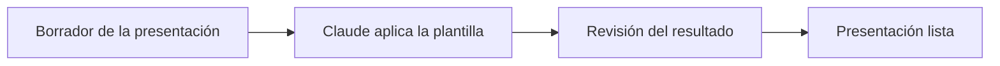

## El problema

Aplicar el diseño de la plantilla oficial de PowerPoint a cada presentación tomaba trabajo manual, revisando el formato diapositiva por diapositiva. El detalle exacto de cuánto pesaba esta tarea en el día a día está `[por confirmar]`.

## Cómo se hace hoy

Antes de contar con la herramienta, cada borrador se ajustaba a mano al formato de la plantilla oficial. Hoy ese trabajo ya cuenta con apoyo automático.

## El caso en datos

| | |
|---|---|
| Qué necesita | El borrador de la presentación y la plantilla oficial de PowerPoint |
| Qué entrega | La presentación lista, con el diseño de la plantilla ya aplicado |

## Cómo se resolvió

Se construyó una herramienta con inteligencia artificial que toma el borrador de una presentación y le aplica automáticamente el diseño y formato de la plantilla oficial. También existe una forma de revisar que el resultado final sea correcto antes de darlo por bueno.

## El flujo

## El impacto

La herramienta ya aplica la plantilla de forma automática a partir del borrador. El tiempo ahorrado y la reducción de errores frente al ajuste manual están `[por confirmar]`.
