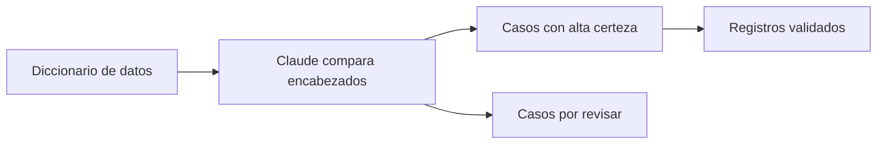

## El problema

Cada regla de calidad de datos se revisa y se aplica de forma manual, una por una, antes de dar por buena la información. A esto se suma que el diccionario que define esas reglas no está conectado directamente con las bases que se cargan todos los días, lo que hace el proceso más lento de lo necesario.

## Cómo se hace hoy

- Se revisa el diccionario de datos y se redacta cada regla de calidad a mano.
- Esas reglas se aplican registro por registro, sin apoyo automático.
- Ya se probó comparar los encabezados de las distintas tablas con ayuda de Claude, revisando primero los casos con mayor certeza.
- Los casos con menor certeza todavía se revisan a mano, uno por uno.

## El caso en datos

| | |
|---|---|
| Qué necesita | El diccionario de datos, las reglas de calidad y las tablas con sus encabezados |
| Qué entrega | Registros ya validados, sin revisión manual uno por uno |
| Herramientas de siempre | Excel y archivos CSV, con apoyo de Claude |

## Qué se está construyendo

Se está probando que Claude ayude a comparar automáticamente los encabezados de las distintas tablas y a aplicar las reglas de calidad, para que el analista no tenga que revisar cada registro uno por uno. La meta a futuro es que la misma herramienta pueda reconocer, clasificar y aplicar nuevas reglas por sí sola, dejando la revisión humana solo para los casos que generen dudas.

## El flujo

## Qué se espera lograr

Se espera reducir el trabajo manual de revisar reglas una por una, acelerar el proceso y disminuir errores. Más adelante, la meta es que la herramienta pueda reconocer y aplicar nuevas reglas por sí misma, dejando la revisión humana solo para los casos más dudosos.
