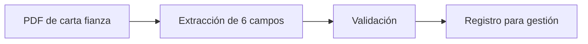

## El problema

Gestionar cartas fianza implicaba un proceso manual de decenas de pasos. El primero —y el más pesado— era leer cada PDF y transcribir a mano los datos importantes. Eso consumía tiempo del equipo de tesorería y abría la puerta a omisiones.

## Cómo se resolvió

Claude lee cada carta fianza en PDF y extrae automáticamente los seis datos clave: empresa, beneficiario, monto, moneda, vencimiento y obligación garantizada. Esos datos quedan listos para continuar el flujo de gestión, sin volver a tipearlos desde cero.

## El flujo

## El impacto

Se elimina la transcripción manual del PDF como cuello de botella. El equipo puede concentrarse en revisar y gestionar, no en copiar datos. Métricas de tiempo ahorrado: [cifra por confirmar].
