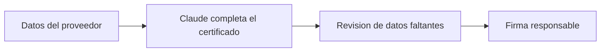

## El problema

Cada mes hay que revisar qué pagos a proveedores del exterior necesitan un certificado de retención de impuestos. Armar ese certificado significa copiar datos a mano entre archivos y convertirlos a un documento final antes de enviarlos a firma. Por lo manual que es, en la práctica el certificado solo se genera cuando el proveedor lo pide, en vez de emitirse todos los meses como debería.

## Cómo se hace hoy

- Se revisan los pagos del mes a proveedores del exterior para identificar cuáles requieren retención.
- Se copian los datos del proveedor desde una hoja de cálculo a la plantilla del certificado.
- Se revisa que toda la información esté correcta y se convierte el documento a PDF.
- Se envía a la persona responsable para su firma.

## El caso en datos

| | |
|---|---|
| Qué lo dispara | La solicitud del proveedor (aunque el certificado debería generarse cada mes) |
| Qué necesita | Los datos del proveedor: importes, fechas, identificación fiscal |
| Qué entrega | El certificado de retención firmado, en español o inglés según el país |
| Herramientas de siempre | Una hoja de cálculo y un procesador de texto |

## Cómo se resolvió

Se probó que una herramienta de inteligencia artificial (Claude) tome los datos del proveedor y complete directamente el certificado, además de limpiar los campos que antes se marcaban a mano para revisión. La prueba funcionó para la mayoría de los datos (importes, fechas, identificación fiscal), y la herramienta detectó por su cuenta cuando faltaba un dato importante, como el domicilio completo del proveedor.

## El flujo

## El impacto

La prueba mostró que la mayoría de los datos se completan correctamente sin copiarlos a mano, y que la herramienta detecta por su cuenta cuando falta información clave para terminar el certificado. El tiempo exacto que esto ahorra por certificado está [por confirmar].
