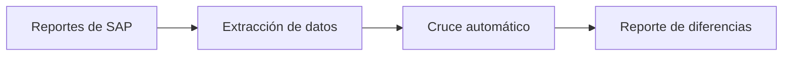

## El problema

Cada mes, Jennifer debía cruzar a mano el libro mayor contra los registros de compras y ventas de 12 empresas del grupo. Era un trabajo repetitivo, largo y fácil de equivocarse: un error en una fila podía pasar desapercibido hasta mucho después.

## Cómo se resolvió

Se armó un flujo con Claude que toma los reportes, identifica cada documento con una clave única y hace el cruce automático. Al final entrega un reporte de diferencias listo para revisar, en lugar de empezar desde cero en una hoja de cálculo.

## El flujo

## El impacto

El tiempo de conciliación bajó de forma clara: lo que antes consumía gran parte del cierre ahora se revisa en mucho menos tiempo. Cifras exactas: [cifra por confirmar]. También se reducen errores humanos al dejar el cruce en un proceso repetible.
