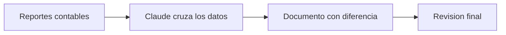

## El problema

Para detectar errores entre lo que registra la contabilidad y el registro de compras, hoy hay que cruzar dos reportes a mano y revisar documento por documento hasta encontrar la diferencia. Este cruce se repite igual en 12 compañías distintas, lo que multiplica el tiempo que toma.

## Cómo se hace hoy

- Se descargan dos reportes distintos del sistema contable.
- Se arma una tabla dinámica de cada uno para agruparlos por tipo de documento.
- Se comparan ambas tablas para ver en qué tipo de documento aparece una diferencia.
- Se filtra ese tipo de documento y se busca uno por uno cuál está generando la diferencia.

## El caso en datos

| | |
|---|---|
| Qué necesita | Los reportes contables descargados del sistema |
| Qué entrega | Una tabla con las diferencias resaltadas por tipo de documento |
| Herramientas de siempre | Un sistema contable y una hoja de cálculo |

## Qué se está construyendo

Se está explorando que una herramienta de inteligencia artificial (Claude) tome ambos reportes y haga el cruce automáticamente, señalando de una vez el documento puntual que genera la diferencia, en lugar de llegar a él por pasos manuales. La idea es que el mismo proceso funcione igual para las 12 compañías, cambiando solo los datos de cada una.

## El flujo

## Qué se espera lograr

Se espera reducir el tiempo que hoy toma revisar documento por documento, y que el mismo proceso se pueda usar igual en las 12 compañías sin rehacer el cruce manual cada vez.
