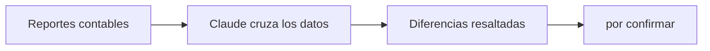

## El problema

Para detectar errores entre lo que registra la contabilidad y lo que aparece en el registro de compras, hoy hay que cruzar manualmente dos reportes en tablas dinámicas y revisar documento por documento hasta encontrar cuál está generando la diferencia. Este cruce se repite igual para 12 compañías distintas.

## Cómo se resolvió

[pendiente: caso aún en desarrollo]

## El flujo

## El impacto

[pendiente: caso aún en desarrollo]
